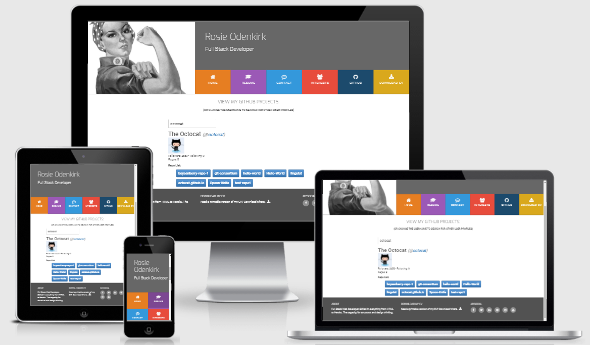

# **Resume Project - Part 2**

# Overview
Code along project to add interactivity to previous Resume project for Rosie Odenkirk using JavaScript, jQuery and utilising APIs.  CI added two pages to the previous project;
* Interests - this was used to work with the Google Maps API
* GitHub - which was used to work with the GitHub API

Email JS was also used to provide actual email response from the Contact Us form.

# Index
1. [UX](#ux)
1. [Features](#features)
    * [Existing Features](#existing-features)
    * [Features for Future Implementation](#features-for-future-implementation)
1. [Technologies Used](#technologies-used)
1. [Credits](#credits)
    * [Website](#website-credits)

## UX

### **Overview and Broad Design Choices**
The UX design for the project would have been undertaken by the Code Institute team.

## Features

### **Existing Features**
Features common to all pages/sections:
* Responsive nav and footer.
* All pages fully responsive to device size and scale accordingly.
* All interactive elements show hover/click functionality.

### **Features for Future Implementation**
1. Add success/failure message for user on submit of contact form | At the moment the email is sent, but the page gives no indication of such to the user.

## Technologies Used

### **Languages**
* HTML5 is used to provide the basic structure of the website.
  * About: [HTML5 Wiki](https://en.wikipedia.org/wiki/HTML5)
  * Creator: [W3 Consortium](https://www.w3.org/)
* CSS3 is used to provide most of the styling for the website.
  * About: [CSS3 Wiki](https://en.wikipedia.org/wiki/CSS)
  * Creator: [W3 Consortium](https://www.w3.org/)
* JavaScript is used to provide the interactive nature of such components throughout the website.
  * About: [JavaScript Home](https://www.javascript.com/)

### **Libraries and Frameworks**
* [Bootstrap 5](https://getbootstrap.com/) is used to provide the grid functionality for uniform design, responsiveness and to enable the use of modal and hamburger menu.
* [jQuery](https://jquery.com/) is used to simplify the implementation of interactive JavaScript components.
* [Google Fonts](https://fonts.google.com/) are used to provide the typography for the website.
* [Font Awesome](https://fontawesome.com/) is used to provide the icons for the website.

### **Tools**
* [Git](https://git-scm.com/)/[GitHub](https://github.com/) were used for version control and repository storage.
* [GitPod](https://www.gitpod.io/) was the IDE used to write the project.
* [Chrome Dev Tools](https://developers.google.com/web/tools/chrome-devtools) were used for specific responsiveness testing and drilling down into bug fixing.

### **Other Resources**
* [Code Institute Full Template](https://github.com/Code-Institute-Org/gitpod-full-template) was used to set up the repository.

## Credits

### **Website Credits**

#### Content
All content, including site images, provided by Code Institute.

#### Media
The images for this README are from the following sources:
* Snips taken from GitHub.
* [Am I Responsive](http://ami.responsivedesign.is/).

#### Other
* Markdown basic taken from [Mastering Markdown](https://guides.github.com/features/mastering-markdown/).

**This website was produced as an educational project for the Code Institute Full Stack Development course.**

**Created by Amy Hacker.**

[Back to Top](#resume-project---part-2)